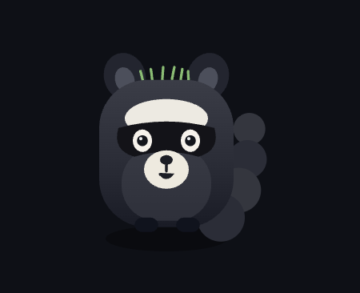
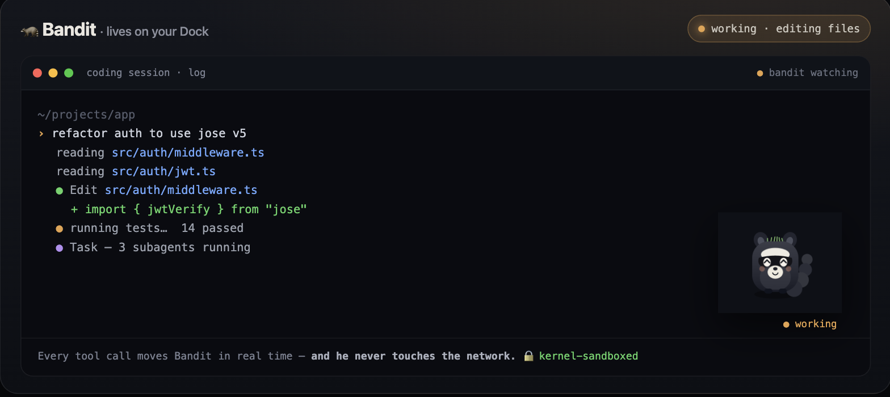
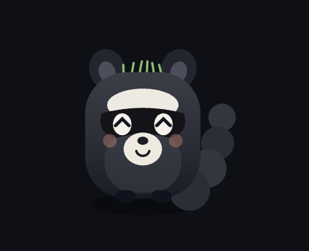
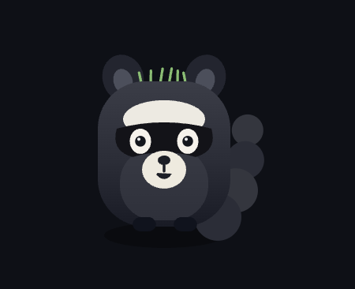

<div align="center">



# 🦝 Bandit

**A little raccoon who lives on your Mac's Dock and reacts to your day.**

He watches your cursor, knows what app you're in, sweats when your CPU spikes,
gets hangry when your battery's low, wakes *all the way up* after midnight, and
paces the Dock across all your screens. Feed him, water him, pet him — and he
**never, ever touches the internet.**


### Install in one line

```sh
curl -fsSL https://raw.githubusercontent.com/DavidSirota/bandit/main/install.sh | sh
```

<sub>No tools needed. Downloads the app, drops it on your Dock, and starts it — sandboxed and offline.</sub>

<br/><br/>



<br/><br/>

  

</div>

---

## What makes Bandit different

Desktop pets are having a moment — but almost all of them are heavy Electron
apps that watch your screen and phone home for "updates." **Bandit is the
opposite:** a tiny native app (Rust + a transparent window, no Electron, no
`node_modules`) that the macOS kernel physically forbids from making a single
network connection. He's cute *and* he's the one you can actually trust to watch
what you're doing.

## What he does

- **Reacts to what you're doing** — nosy in a browser, locked-in while you code, chatty in a terminal, and he calls you out for app-hopping.
- **Reacts to your machine** — sweats when the CPU is pegged, gets *hangry* under 25% battery, dramatically dying under 10%, happy and munching on the charger.
- **Nocturnal** — greets you through the day, and after midnight the raccoon wakes right up. Trash-panda hours. 🌙
- **Roams** — paces the Dock and wanders **across all your monitors**; drag him anywhere and he sticks, feet shuffling as he walks.
- **Care loop** — hover him for **Feed · Water · Pet · Edit**. Meters drift while you're away, so you return to a slightly needy little guy. Gentle by design — he sulks and droops, but never dies. Steady care sprouts a fuller head of grass.
- **Pomodoro buddy** — a Focus timer with a progress ring around him; he nudges you at break time and calls you back to work.
- **Reacts to your coding agent** — perks up on a prompt, bustles while tools run, and jumps when a task finishes. Works with anything that can run a hook (Claude Code, etc.) by writing a word to `~/.deskpet/state`.
- **Make him yours** — recolor his coat and grass, resize him, pick Light / Dark / OS themes, and toggle his chatter on or off.

He floats over fullscreen apps, sits on your Dock with no app icon of his own,
and is fully **click-through** — he never blocks anything.

## Actually private — and you can prove it

| Claim | Check it yourself |
|---|---|
| No networking code in the app | `nm Bandit.app/Contents/MacOS/* \| grep -i reqwest` → empty |
| The webview can't reach the net | `connect-src 'none'` in the config |
| **The kernel forbids all networking** | he runs under `sandbox-exec` with `(deny network*)` |
| No open connections, ever | `lsof -nP -a -p "$(pgrep -x deskpet)" -i` → nothing |
| No npm / hidden deps | the raccoon is drawn in pure `<canvas>` code |

Everything he reads (cursor, frontmost app name, CPU, battery) stays on your
machine, written only to `~/.deskpet/`.

## Install

**Easiest — one line** (prebuilt, no tools):

```sh
curl -fsSL https://raw.githubusercontent.com/DavidSirota/bandit/main/install.sh | sh
```

**Or download it:** grab `Bandit.app.zip` from [Releases](../../releases), unzip, and drag to Applications.

**Build from source** (needs [Rust](https://rustup.rs) + Xcode CLT):

```sh
git clone https://github.com/DavidSirota/bandit && cd bandit
sh build.sh
```

- **Stop:** `launchctl bootout gui/$(id -u)/app.bandit`
- **Uninstall:** `rm -rf ~/Applications/Bandit.app ~/Library/LaunchAgents/app.bandit.plist ~/.deskpet`

## Play with him

- **Move your mouse** — his eyes track you.
- **Hover him** → Feed / Water / Pet / Focus / Edit.
- **Drag his body** to move him anywhere (it sticks across restarts and monitors).
- **Wire him to your agent:** he watches `~/.deskpet/state` — `printf celebrate > ~/.deskpet/state` makes him jump. Any tool with hooks can drive `idle / working / thinking / celebrate / alert`.

## Built with

Pure JavaScript + `<canvas>` (no framework, no image assets — Bandit is drawn
from scratch in code), [Tauri](https://tauri.app) v2 for a tiny transparent
always-on-top window, and a macOS sandbox profile for the network guarantee.
**Bandit is an original character** — no third-party mascots.

## Contributing

Bandit is a personal project shared because he's fun. **I'm not taking issues or
pull requests** and may not respond to them — but please **fork him** and make
your own creature. 🦝

## License

[MIT](LICENSE).
